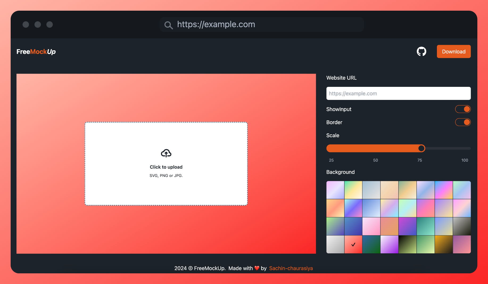

# FreeMockup

Generate free mock-up with ease.

## Ready to make your screenshots look amazing?

### What is this?

Tired of plain screenshots that don't wow anyone? FreeMockUp takes your boring website or app screenshots and transforms them into gorgeous, professional browser mockups that look like they're running on real devices. Perfect for showing off your work like a pro!

### How does it work?

It's ridiculously simple:

1. Drop in your screenshot (any website or app)
2. Pick your device - desktop, tablet, mobile, or laptop
3. Tweak the colors, themes, and settings to match your style
4. Download your stunning mockup - done!

### Why should you care?

- **Show off your portfolio** with mockups that scream "professional"
- **Impress clients** with polished presentations
- **Make social media posts pop** with eye-catching visuals
- **No design skills needed** - we do all the hard work
- **100% free, forever** - no subscriptions, no hidden fees, no BS

Ready to level up your screenshots?
